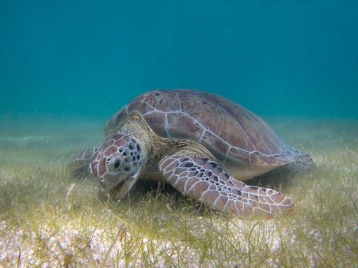
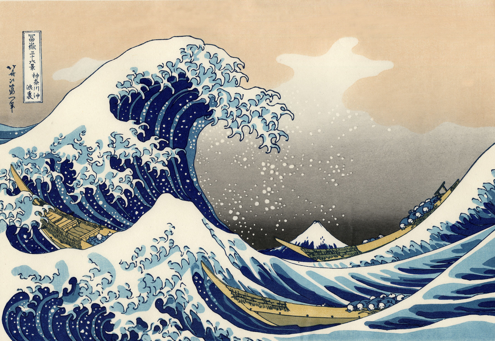
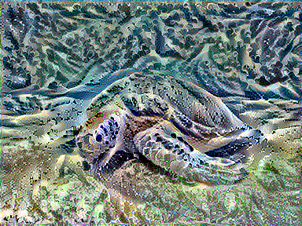
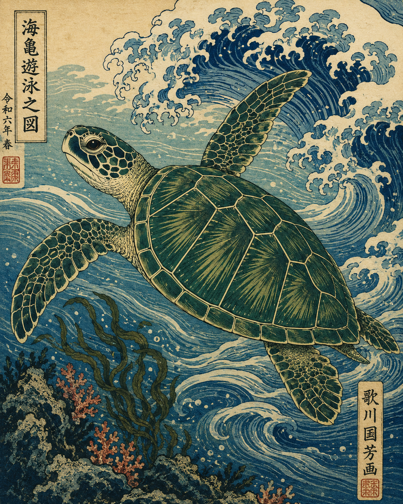

# Neural Style Transfer Project

Author: Ashish Ashish  
Date: May 11, 2026

This project applies neural style transfer to a green sea turtle image using the visual style of Hokusai's *The Great Wave off Kanagawa*. It uses a pretrained VGG19 convolutional neural network in TensorFlow/Keras to preserve the turtle's content while transferring the painting's wave-like texture, color palette, and linework. The project also includes a DALL-E 3 generated image to compare classic neural style transfer with modern text-to-image generation.

## Results

| Content Image | Style Image |
| --- | --- |
|  |  |

| Neural Style Transfer Output | DALL-E 3 Generated Image |
| --- | --- |
|  |  |

## What This Project Demonstrates

- Neural style transfer with TensorFlow and Keras.
- Use of pretrained VGG19 as a fixed feature extractor.
- Content loss, style loss with Gram matrices, and total variation loss.
- A reproducible Jupyter Notebook workflow that generates a standalone HTML submission.
- Comparison between algorithmic style transfer and DALL-E 3 text-to-image generation.

## How It Works

The notebook loads two images: a green sea turtle as the content image and *The Great Wave off Kanagawa* as the style image. VGG19 extracts intermediate feature maps from both images. The generated image starts as a copy of the turtle image, then TensorFlow updates its pixels over 200 iterations so that it keeps the turtle's structure while matching the style statistics of the wave painting.

The main style transfer layers are:

- Content layer: `block5_conv2`
- Style layers: `block1_conv1`, `block2_conv1`, `block3_conv1`, `block4_conv1`, `block5_conv1`

## Repository Structure

```text
.
|-- README.md
|-- requirements.txt
|-- neural_style_transfer_Ashish_Ashish_2026-05-11.ipynb
|-- neural_style_transfer_Ashish_Ashish_2026-05-11_submission.html
|-- assets_notebook/
|   |-- green_sea_turtle.jpg
|   `-- great_wave.jpg
|-- style-transfer-notebook-output/
|   `-- turtle_great_wave_iteration_0200.png
|-- docs/
|   `-- PROJECT_DOCUMENTATION.md
`-- 31e5125c-5155-46b1-bba5-01aced4d5758.png
```

## Quick Start

Install the Python dependencies:

```bash
pip install -r requirements.txt
```

Open the notebook:

```bash
jupyter notebook neural_style_transfer_Ashish_Ashish_2026-05-11.ipynb
```

Run all cells. The final notebook cell creates the standalone HTML submission:

```text
neural_style_transfer_Ashish_Ashish_2026-05-11_submission.html
```

## Key Files

- `neural_style_transfer_Ashish_Ashish_2026-05-11.ipynb` - main executable notebook.
- `neural_style_transfer_Ashish_Ashish_2026-05-11_submission.html` - generated standalone submission file.
- `docs/PROJECT_DOCUMENTATION.md` - concise project explanation, algorithm notes, and run instructions.
- `requirements.txt` - Python dependencies.

## Notes

- VGG19 ImageNet weights are downloaded locally by TensorFlow/Keras and are not committed to the repository.
- The notebook includes a final cell that can regenerate the HTML submission.
- The DALL-E 3 image is embedded inside the notebook and is also included as a PNG file for GitHub preview.
